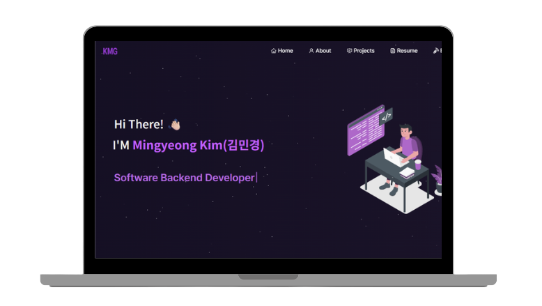

<h2 align="center">
  Mingyeong Kim's Portfolio 
  <a href="https://kmg22.me" target="_blank">kmg22.me</a>
</h2>

  

 

 

 

 

##  About Me

안녕하세요! **인프라와 보안을 중시하는 백엔드 개발자 김민경**입니다. 
숭실대학교 소프트웨어학부(정보보호융합전공)에 재학중이며, 안정적이고 확장 가능한 시스템을 구축하는 데 관심을 갖고 있습니다.

- 🎓 **GPA**: 4.3 / 4.5
- 🛡️ **Major**: Information Security Convergence
- 🏗️ **Core**: Spring Boot, Kubernetes, Web Security Research

##  Key Projects

1. **인천 지역 특화 낚시 정보 플랫폼** (Spring Boot/PostgreSQL)
2. **패키지 환각 기반 LLM 공급망 공격 탐구** (Security Research)
3. **V2X기반 긴급차량 피양 시스템 시뮬레이션** (SUMO/Veins)
4. **FIREBAT N100 기반 홈서버 구축 및 운영** (Ubuntu Server/K8s)

